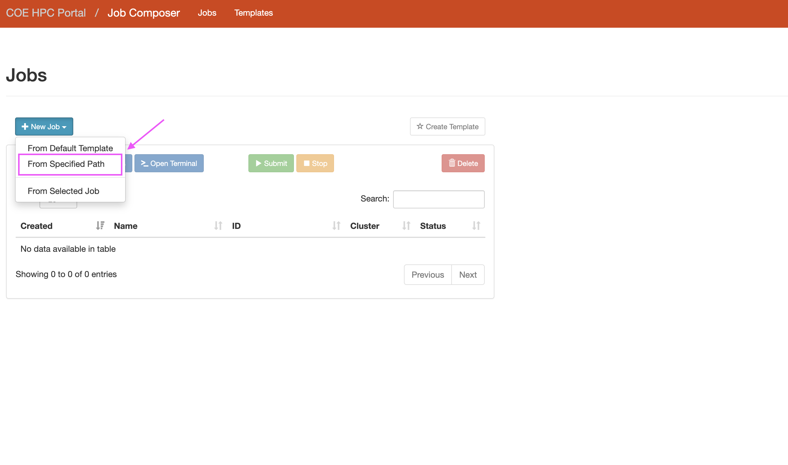
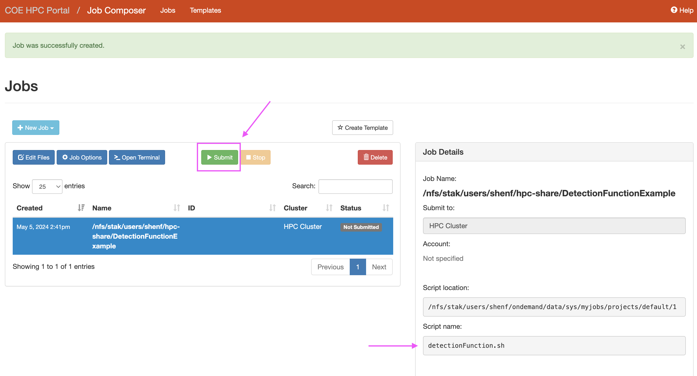

# ClusterDemo
Author: Fang-Yu (Betty) Shen;
Date: May 5, 2024
## Goal
This tutorial demonstrates running R script through COE High Performance Computing Cluster (HPC)(i.e., cluster, supercomputer) with parallel computing which maximizes computation efficacy.
## Pros
The biggest benefit of running your R script through cluster is parallel computing, which means your task can be implemented into multiple cores at once. Why is this helpful? Because when you run your R script in R from your desktop, the script will run on one core in your local machine. With parallel computing, you can run your script with multiple cores simultaneously. Of course, you will need to set up parallel computing R code in your script to activate this function. The script I provided in this repository has incorporated running parallel in R. More information on how to create R script for parallel computing can refer to [this webpage](https://www.r-bloggers.com/2017/10/running-r-code-in-parallel/). 
## Cons
Of course, not everything comes to good side. The biggest challenge to run parallel on the cluster is taking more steps to submit and edit changes to the script. Once you find error in your script, you will have to edit your code and resubmit again. Sometimes, it is time-consuming if you were to modify many lines of code from your local computer and upload the script again. Although you can edit the script on the cluster portal, it is not recommended because you shouldn't be storing your file on cluster as a long-term backup. Plus, you might lose track when making edits on cluster portal without synchronously updating the script on your local computer or file directory. I recommend running a partial of your script on your local machine and making sure the process looks great before submitting your task through cluster.

# Instructions
## Create a College of Engineering HPC Account
1. Since we are not College of Engineering students, we need to request an account from [HPC administration](https://it.engineering.oregonstate.edu/hpc).

  
 
 
2. After creating your account, log in to the [HPC portal](https://ondemand.hpc.engr.oregonstate.edu/). It is performed by the OnDemand interface. You will be prompted to enter your account and passwords.

 
 

## OnDemand Portal
1. Once you log into OnDemand portal, you will see the home page. On the top of the page, click the **Files** and then **Home Directory**. You will see all directories associated with your account.

 
 

2. In your home directory, click the **hpc-share** folder. This folder will be your working folder, where all scripts and data are stored.

 
 

## Create Folder & Upload files
1. To stay well-organized, it is recommended to create a folder for your specific project. Click the **New Directory** button to create a folder for your project.

 
 

2. Now, you can click the **Upload** button to upload all your R scripts, data, and bash scripts (.sh). Humm...what is a bash script? Bash script is a script that tells the cluster what to do with your code, including what program you are running, and how many memories and cores you are requesting. Check out the example bash script I provided in this repository.

 
 
>[!NOTE]
> In this tutorial, R script (detectionFunction.R), bird data (multiSP_Data.csv), and bash script (detectionFunction.sh) are provided. Please check out those files in this repository.

>[!IMPORTANT]
> Please make sure your R script has all correct paths to the directory that links to OnDemand portal since all your data is stored here. You will no longer access files on your local computer. Please see the section below which indicates specific path that needs to change.
 
### Change Directory Path in R Script
You will have to change the following path: setting working directory, data path, and PNG export path.

 
 

## Create & Submit Job
1. To create a job that runs your script, click **Jobs** and then **Job Composer**. It will take you to the next page to let you point out which bash script to run your code.

 
 

2. Hit the **New Job** button and select **From Specific Path**

 
 

3. In the job composer, type in the path in the **Source Path**, where all your data, R script, and bash script are stored. Below, type in the name of the bash script (ends with `.sh`) in the **Script Name**. Finally, click **Save**.

 
 

4. You will be redirected to the job composer page. Here, double-check with the bash script whether it is correctly printed. If everything looks great, hit the **submit** button. Your script should show **running** or **queued**.

 
 

# More Information
Sometimes, clusters are under maintenance. The administrator will announcement if the system breaks down or is scheduled for future maintenance. Check out [HPC cluster official](https://it.engineering.oregonstate.edu/hpc) page to acquire the most up-to-date information. To check the quota and limit we can use, refer to [Slurm Howto](https://it.engineering.oregonstate.edu/hpc/slurm-howto) page.
